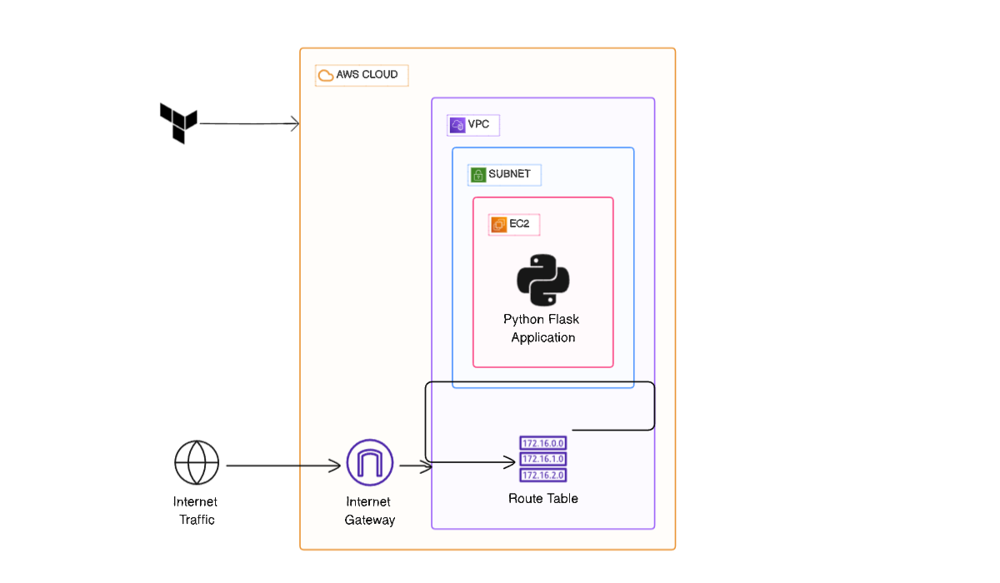

# Deploying Python Flask Application on AWS Cloud using Terraform Provisioners

## Project Description
In this project, I leveraged Terraform Provisioners and AWS to create an automated and consistent deployment pipeline for applications on Amazon EC2 instances. This project is an **automation solution** designed to simplify the deployment of applications on AWS EC2 instances. Here, I deploy a simple **Python Flask** web application.

---

## Overview

Below is a visual representation of the architecture and workflow of this project:



> **Note:** Replace `map.png` with the actual relative path if you host it on GitHub.

---

## Step-by-Step Workflow

### 1. Define AWS Infrastructure Using Terraform
- **VPC & Subnets:** Set up a VPC with public and private subnets.  
- **Security Groups:** Define inbound and outbound rules for SSH (22) and HTTP/Flask App (80/5000).  
- **Key Pair:** Create or use an existing key pair for EC2 instance SSH access.  
- **EC2 Instances:** Provision EC2 instances to host the Flask application.

```hcl
resource "aws_instance" "server" {
  ami                    = var.ami_id
  instance_type          = var.instance_type
  key_name               = "terraform-key"
  vpc_security_group_ids = [aws_security_group.webSg.id]
  subnet_id              = aws_subnet.sub1.id
}
```

---

### 2. Connect to EC2 Using Terraform Provisioners
- **SSH Connection:** Terraform connects to EC2 using the key pair.  
- **File Provisioner:** Upload Flask application code to EC2.  
- **Remote-Exec Provisioner:** Install dependencies, setup a virtual environment, and run the Flask app.

```hcl
provisioner "remote-exec" {
  inline = [
    "sudo apt update -y",
    "sudo apt install -y python3-venv python3-pip",
    "cd /home/ubuntu",
    "python3 -m venv venv",
    "source venv/bin/activate && pip install flask",
    "source venv/bin/activate && nohup python3 app.py > app.log 2>&1 &"
  ]
}
```

---

### 3. Flask Application
- **Simple Flask App** to test deployment:

```python
from flask import Flask

app = Flask(__name__)

@app.route('/')
def home():
    return "<h1>Hello from Terraform Flask App 🚀</h1>"

if __name__ == '__main__':
    app.run(debug=True, host='0.0.0.0', port=5000)
```
- Application runs on **port 5000** (or 80 if modified).

---

### 4. Key Features
- **Infrastructure as Code (IaC):** All AWS infrastructure is defined in Terraform scripts.  
- **Efficient EC2 Instance Provisioning:** Quick and reliable resource creation.  
- **Automated Application Deployment:** Terraform provisioners handle package installation, environment setup, and running the Flask app.  
- **Flexibility & Scalability:** Scale resources effortlessly using Terraform.  
- **Security by Design:** Implemented security best practices with IAM roles and security groups.

---

### 5. Outputs
- After `terraform apply`, outputs include:  
  - **Public IP** of EC2 instance  
  - **Web link** to access Flask application

---

### 6. Usage
1. Clone the repository.  
2. Update `variables.tf` with your AWS AMI ID, instance type, and key pair name.  
3. Run Terraform commands:

```bash
terraform init
terraform plan
terraform apply
```

4. Access your Flask app in browser using the EC2 public IP and port `5000`.

---

### 7. Troubleshooting Tips
- Ensure **key pair** exists and matches the `.pem` file path.  
- Check **security group rules** for HTTP/SSH/Flask ports.  
- Activate Python virtual environment if dependencies fail:

```bash
cd /home/ubuntu
source venv/bin/activate
pip install flask
nohup python3 app.py > app.log 2>&1 &
```

